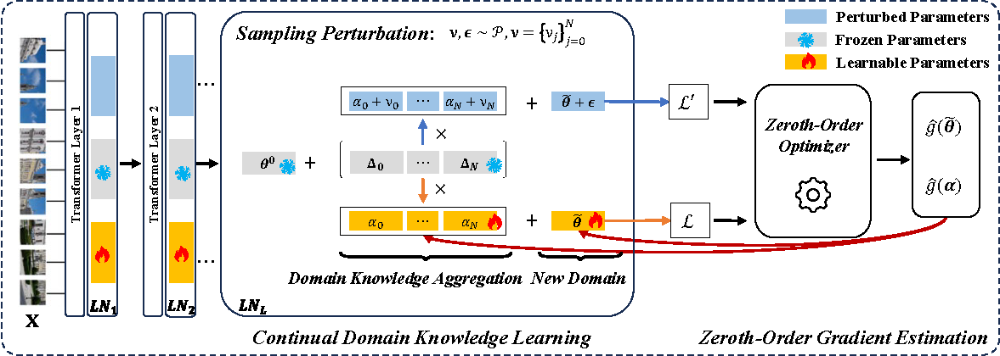

# Test-Time Model Adaptation for Quantized Neural Networks

This is the official project repository for [Test-Time Model Adaptation for Quantized Neural Networks (ACM MM 2025)](https://arxiv.org/pdf/2508.02180) by Zeshuai Deng, Guohao Chen, Shuaicheng Niu, Hui Luo, Shuhai Zhang, Yifan Yang, Renjie Chen, Wei Luo, Mingkui Tan.

# Introduction

Our ZOA conducts model learning at test time to adapt a **quantized model** to test data that has distributional shifts ☀️ 🌧 ❄️, such as corruptions, simulation-to-real discrepancies, and other differences between training and testing data. In a nutshell, ZOA offers the following benefits:

  * **Backprop-free & lightweight:** Adapts models using only **two forward passes** per sample—no gradients, no optimizer state. This keeps memory and latency very low, ideal for real-time use.
  * **Made for quantized models:** Specifically addresses the robustness gap of **QNNs** under distribution shift, where backpropagation is often unsupported or impractical. 
  * **Continual domain knowledge:** Learns, stores, and **reuses** compact domain knowledge over long test streams to stabilize adaptation with negligible extra memory. 
  * **Broad applicability:** Validated on both **Transformers and CNNs** across multiple bit-widths (e.g., W8A8/W6A6/W4A4), showing architecture- and precision-agnostic behavior.


<p align="center">

</p>


**Dependencies Installation:**
```
pip install -r requirements.txt

# install mqbench to obtain the quantized resnet50
git clone git@github.com:ModelTC/MQBench.git
cd MQBench
pip install -v -e .
```

(Optional) 
If the experiments on the quantized ResNet50 model raise an error, please use the lower version of mqbench.
```
git clone git@github.com:ModelTC/MQBench.git -b mqb-torch1.10
cd MQBench
pip install -v -e .
```
(Optional) Or you can fix the bugs by changing line 277  of `MQBench/mqbench/custom_quantizer/model_quantizer.py` using the following:
```
# reassign[name] = swap_module(mod, mapping, {}, False)
reassign[name] = swap_module(mod, mapping, {})
```


## Data Preparation

This repository contains code for evaluation on ImageNet-C with ViT-Base and ResNet50 models. But feel free to use your own data and models! Please check [here 🔗](dataset/README.md) for a detailed guide on preparing these datasets.

# Example: ImageNet-C Experiments

**Usage (W8A8 precision experiments):**
```
# W8A8 ViT-Base model
python3 main.py --output ./outputs --algorithm 'zoa_vit' --tag '_8bit' --lr 0.0005 --sc 0.02 --lambda_bp 30 --quant --bit 8 --domain_t 0.1

# W8A8 ResNet50 model
python3 main.py --output ./outputs --algorithm 'zoa_resnet' --tag '_8bit' --arch resnet50 --lr 0.0001 --sc 0.01 --lambda_bp 1 --use_in1k_norm --use_in1k_norm_c --quant --bit 8 --domain_t 0.2
```


Please see our [PAPER 🔗](https://arxiv.org/pdf/2508.02180) for more detailed results.

# Citation

If our ZOA method or the setting of test-time adaptation for quantized models is helpful in your research, please consider citing our paper:

```
@inproceedings{deng2025test,
  title={Test-Time Model Adaptation for Quantized Neural Networks},
  author={Deng, Zeshuai and Chen, Guohao and Niu, Shuaicheng and Luo, Hui and Zhang, Shuhai and Yang, Yifan and Chen, Renjie and Luo, Wei and Tan, Mingkui},
  journal={Proceedings of the ACM International Conference on Multimedia},
  year={2025}
}
```

# Acknowledgment

The code is inspired by [FOA 🔗](https://github.com/mr-eggplant/FOA) and [COLA 🔗](https://github.com/Cascol-Chen/COLA)